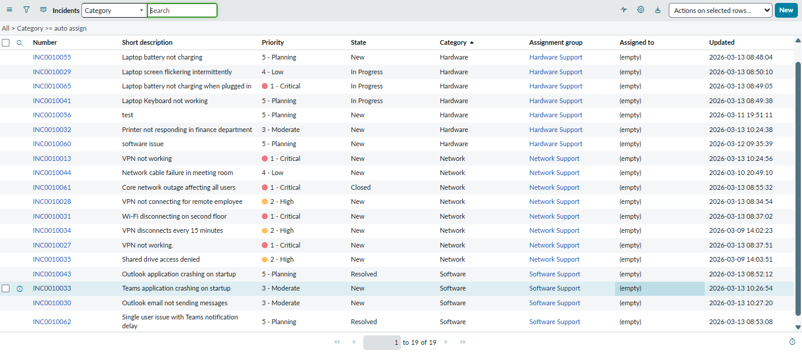
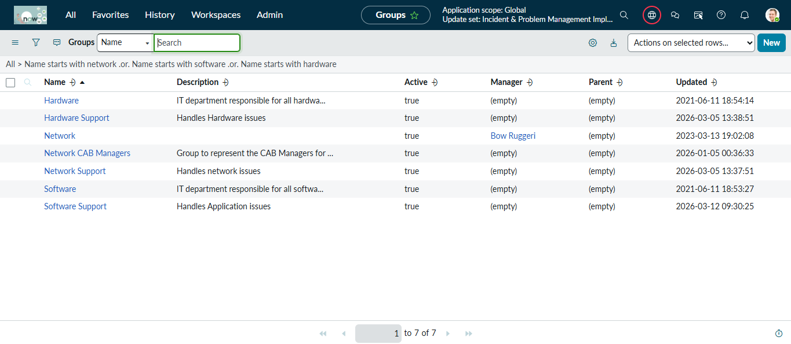
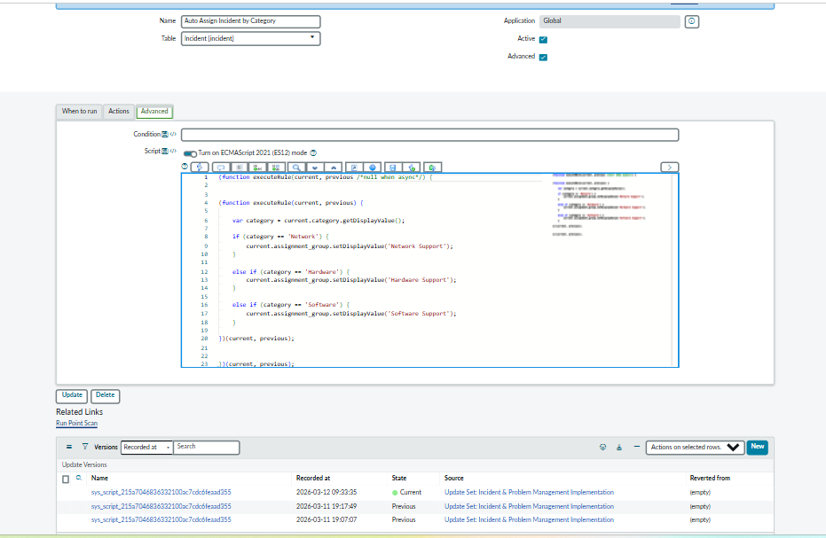
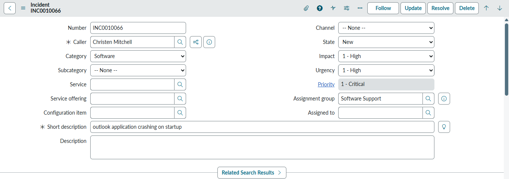
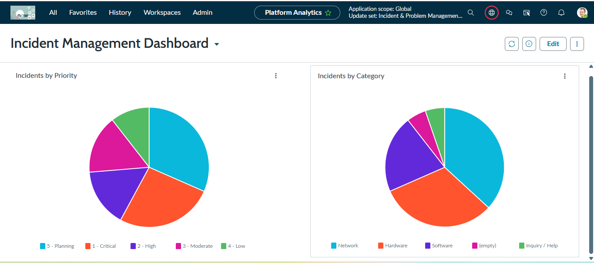

# Enterprise Incident & Problem Management Implementation in ServiceNow

## Project Overview

This project demonstrates the implementation of an ITIL-aligned Incident and Problem Management solution using the ServiceNow platform.

The goal of the project was to simulate a real enterprise IT support environment by configuring incident workflows, automation rules, SLA tracking, reporting dashboards, and problem management for recurring issues.

The implementation shows how ServiceNow can streamline IT support operations by automatically assigning tickets to the correct support teams, prioritizing incidents based on impact and urgency, tracking resolution timelines through SLAs, and identifying root causes for repeated incidents.

---

## Incident Management Implementation

A complete Incident Management workflow was configured to manage the lifecycle of IT support tickets.

Incident lifecycle states implemented:

New → In Progress → On Hold → Resolved → Closed

Sample incidents were created to simulate real IT support scenarios including:

• VPN not connecting for remote employee  
• Laptop screen flickering intermittently  
• Outlook email not sending messages  
• Wi-Fi disconnecting on second floor  
• Printer not responding in finance department  
• Teams application crashing on startup  
• Shared drive access denied  

These incidents were used to test automation logic, SLA tracking, and reporting dashboards.

---

## Priority Automation

Incident priority is automatically calculated using Impact and Urgency through a Client Script.

Example logic:

Impact 1 + Urgency 1 → Priority 1 (Critical)

Impact 2 + Urgency 2 → Priority 2 (High)

Lower impact incidents receive lower priority levels.

This ensures that business-critical issues are handled first.

---

## Automatic Incident Assignment

A Business Rule was implemented to automatically assign incidents to the appropriate support group based on the selected category.

Assignment logic:

Network incidents → Network Support  
Hardware incidents → Hardware Support  
Software incidents → Software Support  

This automation improves ticket routing efficiency and reduces manual triage work for IT support teams.

---

## SLA Management

A Service Level Agreement (SLA) was configured to monitor incident resolution timelines.

Configured SLA:

Incident Resolution Time — 4 Hours

The SLA automatically attaches to incidents and tracks the remaining time available for resolution. This helps ensure service delivery targets are met and provides visibility into potential SLA breaches.

---

## Reporting & Dashboards

Reports were created to visualize incident data and operational trends.

Reports implemented:

• Incidents by Category  
• Incidents by Priority  

These reports were added to a dashboard to provide a quick overview of incident distribution and workload.

---

## Problem Management

To demonstrate Problem Management, a problem record was created for recurring VPN connectivity issues.

Problem created:

Recurring VPN Connectivity Failures

Multiple related incidents were linked to this problem record to represent repeated user issues.

This process helps identify root causes and prevents recurring incidents.

---

## Key Features Implemented

• Incident lifecycle management  
• Automatic ticket assignment using Business Rules  
• Priority automation using Client Scripts  
• SLA tracking for incident resolution  
• Reporting and operational dashboards  
• Problem management for recurring issues  

---
## Architecture / Workflow
The following workflow represents the Incident and Problem Management implementation.

User reports issue  
↓  
Incident record created in ServiceNow  
↓  
Business Rule automatically assigns the incident to the correct support group based on category  
↓  
Client Script calculates priority using impact and urgency values  
↓  
SLA attaches to the incident and tracks resolution time  
↓  
Support team resolves the incident  
↓  
Recurring incidents are linked to a Problem record for root cause analysis

---
## Challenges & Solutions

During the implementation several challenges were encountered while configuring automation and workflow logic.

### 1. Incident Assignment Automation
Initially incidents were not automatically assigning to the correct support group due to incorrect category values and missing group sys_id references in the Business Rule.

**Solution:**  
Updated the Business Rule logic and verified group sys_id values to ensure incidents are routed correctly based on category.

---

### 2. Priority Calculation Logic
Priority was not updating consistently when impact or urgency values changed.

**Solution:**  
Implemented client scripts on both the *Impact* and *Urgency* fields to dynamically recalculate the priority whenever either value changes.

---

### 3. SLA Attachment
The SLA did not attach to incidents during testing because the start condition was incorrectly configured.

**Solution:**  
Adjusted the SLA definition condition to trigger when priority equals **1 - Critical** and validated the lifecycle states for resolution tracking.

---

### 4. Problem Record Association
Linking incidents to a problem record required configuring the correct related list and verifying the reference field.

**Solution:**
Enabled the problem reference field on the incident form and linked recurring incidents to a problem record for root cause analysis.

---
## Project Outcome

This project demonstrates how ServiceNow can automate IT support workflows, improve ticket routing efficiency, track service performance through SLAs, and identify recurring issues using problem management.

The implementation reflects how enterprise organizations manage IT service operations using the ServiceNow platform.

---

## Screenshots

