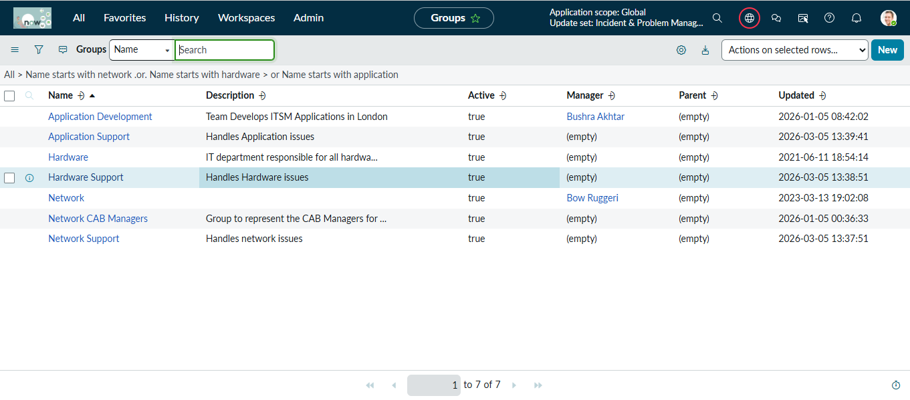
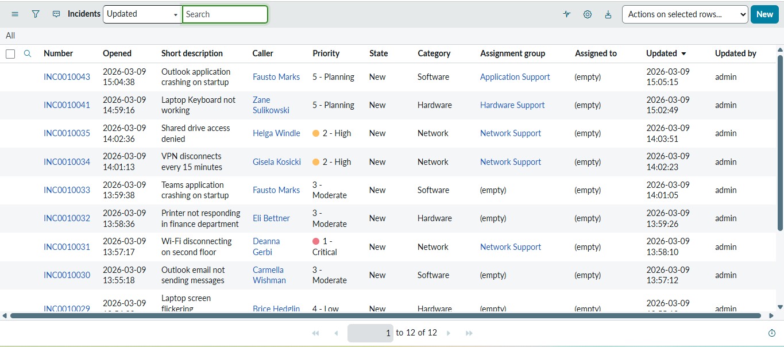
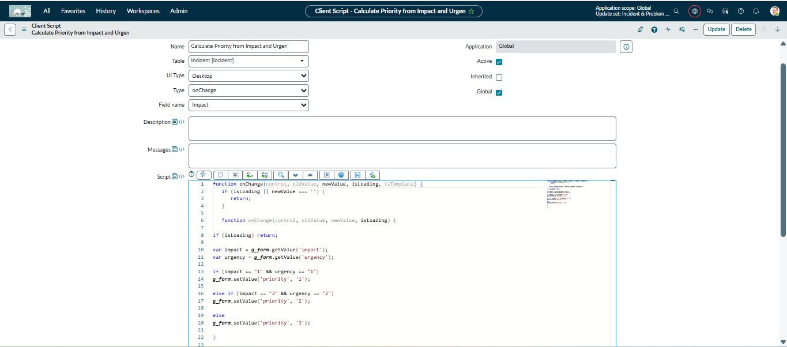
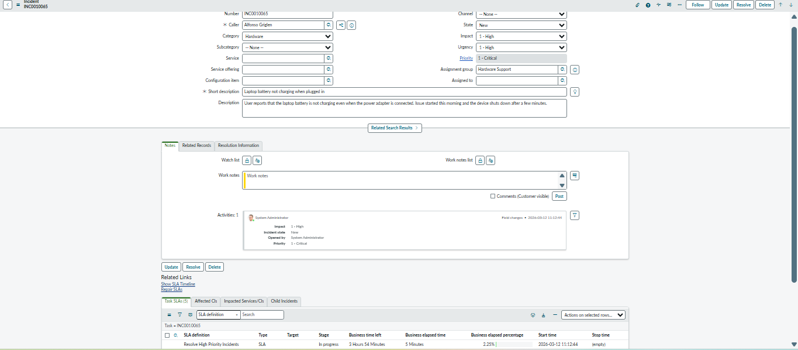
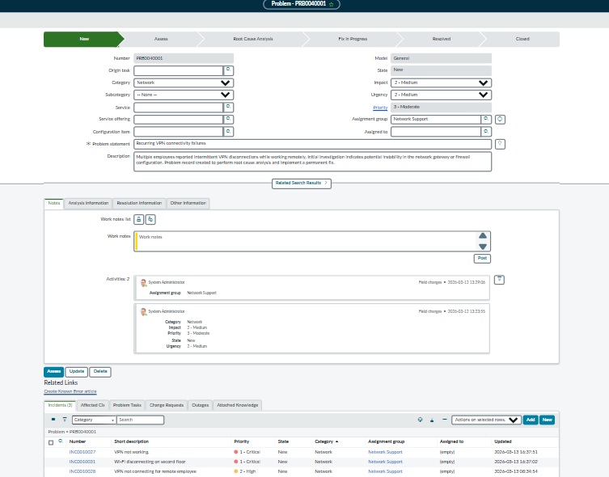

# Enterprise Incident & Problem Management Implementation in ServiceNow

## Project Overview
This project demonstrates the implementation of an ITIL-aligned Incident and Problem Management process using the ServiceNow platform. The solution automates ticket assignment, priority calculation, SLA tracking, and enables root cause analysis through Problem Management.

The objective of this project is to simulate a real-world enterprise ServiceNow environment where IT support teams manage incidents efficiently and identify recurring issues for long-term resolution.

---

## Key Features Implemented

### Incident Management
- Created and managed incident records for IT support issues
- Implemented incident lifecycle states (New, In Progress, Resolved, Closed)
- Categorized incidents by Hardware, Software, and Network

### Automated Incident Assignment
Configured a Business Rule to automatically assign incidents to the appropriate support group based on the selected category.

Example logic:
- Network → Network Support
- Hardware → Hardware Support
- Software → Application Support

### Priority Automation
Configured automation to determine incident priority based on **Impact and Urgency** following ITIL best practices.

Example:
Impact 1 + Urgency 1 → Priority 1 (Critical)

### SLA Management
Configured Service Level Agreements to track response and resolution times for incidents based on priority levels.

Example SLAs:
- P1 Response SLA – 15 minutes
- P1 Resolution SLA – 1 hour

### Dashboard & Reporting
Created a ServiceNow dashboard to visualize incident data and monitor system performance.

Reports included:
- Incidents by Priority
- Incidents by Category

### Problem Management
Implemented Problem Management to identify root causes of recurring incidents.

Example problem created:
Recurring VPN connectivity failures affecting multiple employees.

Multiple related incidents were linked to this problem record for investigation and long-term resolution.

---

## Technologies Used
- ServiceNow ITSM
- Incident Management
- Problem Management
- Business Rules
- Client Scripts
- SLA Management
- ServiceNow Reporting
- Platform Analytics Dashboards

---

## Project Screenshots

### Incident List
![Incident List]

### Assignment Groups

### Business Rule – Auto Assignment

### Auto Assignment Working

### Priority Automation – Client Script

### SLA Running

### Incident Management Dashboard

### Incidents by Priority Report

### Incidents by Category Report

### Problem Record with Linked Incidents

---

## Outcome
This project demonstrates how ServiceNow can automate IT support operations, improve incident response time, and help organizations identify and resolve recurring issues through structured ITIL processes.
