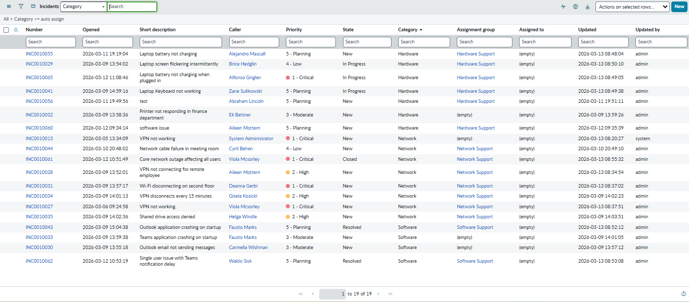

ServiceNow Developer Portfolio
Enterprise Incident & Problem Management Implementation

## Project Overview

This project demonstrates the implementation of an ITIL-aligned Incident and Problem Management solution using the ServiceNow platform. The goal of this implementation was to simulate a real enterprise IT support environment by configuring incident workflows, automation, SLA tracking, reporting dashboards, and problem management for recurring issues.

The system helps streamline IT support operations by automatically assigning tickets to the appropriate support teams, calculating priority based on business impact, tracking resolution timelines through SLAs, and identifying root causes for repeated incidents.

---

## Incident Management Implementation

A complete Incident Management workflow was configured to manage the lifecycle of IT support tickets.

Incident lifecycle states implemented:

New → In Progress → On Hold → Resolved → Closed

To simulate real operational data, multiple sample incidents were created across different categories such as Network, Hardware, and Software issues.

Example incidents include:

- VPN not connecting for remote employee  
- Laptop screen flickering intermittently  
- Outlook email not sending messages  
- Wi-Fi disconnecting on second floor  
- Printer not responding in finance department  
- Teams application crashing on startup  
- Shared drive access denied  

These records were used to test automation rules, SLA tracking, and reporting.

---

## Priority Automation

Incident priority is automatically calculated using Impact and Urgency values through a Client Script.

Example logic:

- Impact 1 + Urgency 1 → Priority 1 (Critical)
- Impact 2 + Urgency 2 → Priority 2 (High)
- Lower impact issues receive lower priority levels

This ensures that critical incidents affecting business operations receive faster attention.

---

## Automatic Incident Assignment

A Business Rule was implemented to automatically assign incidents to the correct support group based on the selected category.

Assignment logic used:

Network incidents → Network Support  
Hardware incidents → Hardware Support  
Software incidents → Software Support  

This automation reduces manual triage and ensures tickets are routed to the correct support teams.

---

## SLA Management

A Service Level Agreement (SLA) was configured to monitor incident resolution timelines.

Configured SLA:

Incident Resolution Time – 4 Hours

The SLA automatically attaches to incidents and tracks the remaining time for resolution. This helps ensure support teams meet service delivery targets and prevents SLA breaches.

---

## Reporting & Dashboard

Reports were created to provide operational visibility into incident data.

Reports implemented:

- Incidents by Category
- Incidents by Priority

These reports were added to a dashboard to visualize incident trends and workload distribution across categories and priority levels.

---

## Problem Management

To demonstrate ITIL Problem Management, a problem record was created for recurring VPN connectivity issues.

Problem created:

Recurring VPN Connectivity Failures

Multiple related incidents were linked to this problem record to represent repeated issues affecting users.

This process helps identify the root cause of incidents rather than only resolving them individually.

---

## Key Features Implemented

- Incident lifecycle management
- Automated incident assignment using Business Rules
- Priority calculation using Client Scripts
- SLA tracking for incident resolution
- Incident reporting and dashboards
- Problem management for recurring incidents

---

## Project Screenshots

### Incident List

### Assignment Groups

### Business Rule – Auto Assignment

### Incident Auto Assignment Working

### Priority Client Script

### SLA Running on Incident

### Incident Dashboard

### Problem Record with Linked Incidents

---

## Outcome

This project demonstrates how ServiceNow can be configured to automate IT support workflows, improve ticket routing efficiency, monitor service performance through SLAs, and identify recurring issues through problem management.

The implementation reflects how enterprise organizations manage IT service operations using the ServiceNow platform.
